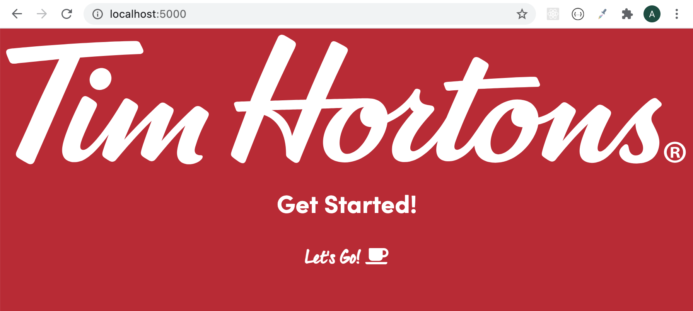

# TH Starter

This repo is set up with the TH logo and font faces, plus font awesome icons.

Font faces are declared in `css/fonts.css`. Feel free to look at how this is implemented, but you shouldn't need to edit this file.

You will see examples of how the font faces can be used in `css/styles.css`. You can edit this file in any way you see fit.

## To run

```
npx serve
```



## This repo is read only for students

To use as a student for a project that uses TH assets:

```
git clone
cd th-starter
git remote remove origin
```

Create a new repository on your personal GitHub account, and copy its git url. Then:

```
git remote add origin <paste url>
```

Do your work

```
git add .
git commit -m "your commit message"
git push -u origin master
```
